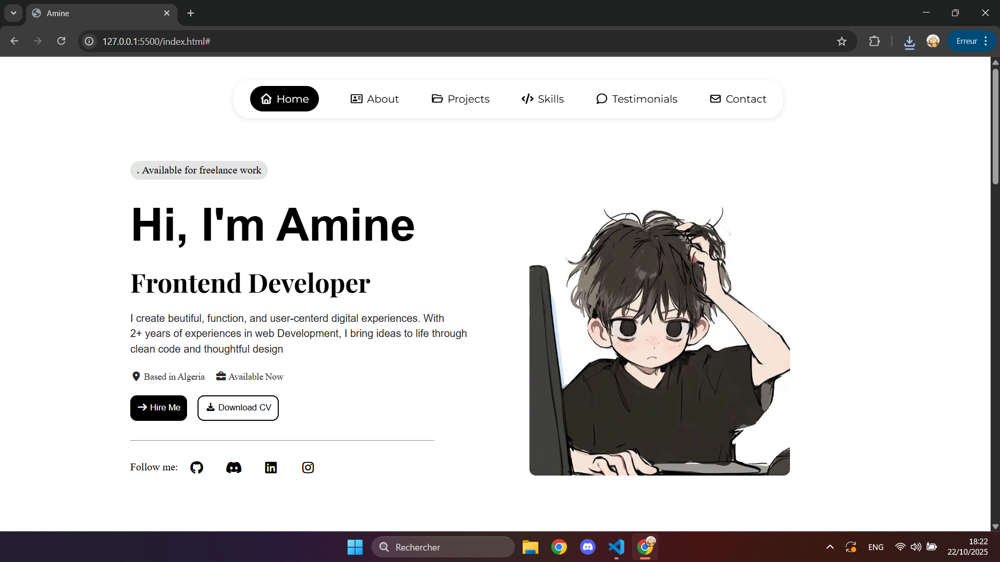

# 🚀 Nikhil's Personal Portfolio 

Welcome to my personal portfolio repository! This is a modern, responsive, and visually appealing web portfolio built to showcase my projects, experiences, and skills as a Creative Technologist and Frontend Developer.

## 🌟 UI Preview



## ✨ Features

- **Dynamic Loading Screen**: A sleek terminal-style bootup sequence that seamlessly transitions into the main portfolio.
- **Modern UI/UX**: Clean layout with carefully chosen typography, micro-animations, and dynamic reveal effects on scroll.
- **Fully Responsive**: Beautifully optimized for desktops, tablets, and mobile devices.
- **Project Showcase**: A dedicated section to highlight featured work like *Revive-hub* and *Hospital Pulse AI*.
- **Experience Highlights**: A visual representation of my hackathon achievements (e.g., IIT Mandi HackBio Winner), leadership roles, and community management.

## 🛠️ Technologies Used

- **HTML5**: Semantic and accessible markup structure.
- **CSS3**: Vanilla CSS with custom properties, flexbox, grid, and keyframe animations.
- **JavaScript (Vanilla)**: For interactive elements, smooth scrolling, and dynamic state management.
- **Font Awesome**: Scalable vector icons for clean visuals.
- **Google Fonts**: Custom typography for a personalized look.

## 🚀 Getting Started

To get a local copy up and running, follow these simple steps:

1. **Clone the repository**
   ```bash
   git clone https://github.com/nikhil09790/porotofilo8.git
   ```
2. **Navigate to the project directory**
   ```bash
   cd porotofilo8
   ```
3. **Open the project**
   Simply open `index.html` in your favorite web browser to view the site. No build tools required!
   *(Tip: Use the Live Server extension in VS Code for a better development experience with hot-reloading).*

## 📬 Contact Me

Feel free to reach out if you'd like to collaborate, discuss a project, or just say hi!

- **Email**: [seemayadav97950@gmail.com](mailto:seemayadav97950@gmail.com)
- **LinkedIn**: [Nikhil Yadav](https://www.linkedin.com/in/nikhil-yadav-4b63212ba)
- **GitHub**: [@nikhil09790](https://github.com/nikhil09790)
- **WhatsApp**: [+91 7524884044](https://wa.me/917524884044)

---

*Designed and Built with ❤️ by Nikhil Yadav*
